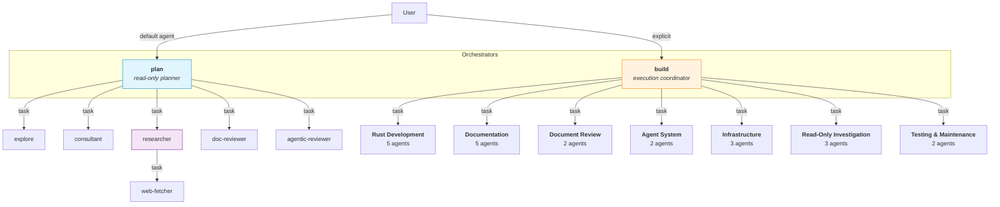
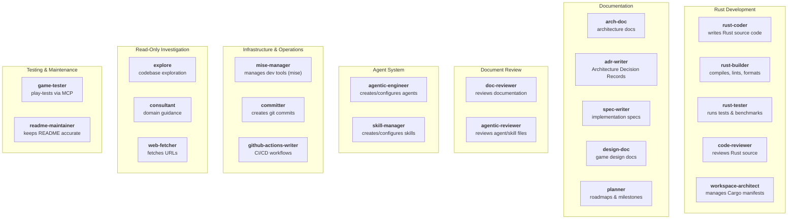

# Desert City-States

**Genre:** Small-scale 4X strategy — rival oasis city-states competing for survival and dominance across a sparse hex map in a harsh desert.

**Tech:** Rust, macroquad 2D renderer, turn-based, hex grid, water scarcity + trade-route control as the core tension.

**Workspace:** 5-crate Cargo workspace.

| Crate | Role |
|---|---|
| `dcs-core` | Pure, deterministic, serializable simulation — all game logic, zero rendering |
| `dcs-protocol` | Save-file schema versioning + command/event envelopes |
| `dcs-render` | macroquad presentation layer (2D graphical, immediate-mode) |
| `dcs-app` | Main entry point, main-loop glue, input → command dispatch |
| `dcs-mcp` | MCP server for headless play-testing and tooling |

📖 **Game design** → [`docs/design/Desert-City-States.md`](docs/design/Desert-City-States.md)  
🏛️ **Software architecture** → [`docs/architecture/ARCHITECTURE.md`](docs/architecture/ARCHITECTURE.md)

---

## Multi-Agent Development Architecture

This project uses an **OpenCode agentic framework** with **24 specialized agents** and **18 skills** to automate and orchestrate development. The system follows a structured delegation hierarchy with strict role separation.

### Tier 1 — Overview: Delegation Flow

Two orchestrators sit at the top: `plan` (the default read-only planner) and `build` (the execution coordinator). They delegate tasks to category groups and individual specialists. Only `researcher` delegates further (to `web-fetcher`).

### Tier 2 — Detailed Agent Taxonomy

All agents grouped by domain with their role descriptions:

### Architecture Summary

- **2 orchestrators**: `plan` (default read-only planner) and `build` (execution coordinator)
- **22 subagent specialists** across 7 domains (plus 1 delegating specialist: `researcher`)
- **Maximum delegation depth of 2** (orchestrator → subagent → web-fetcher)
- **Deny-by-default permission model** with least-privilege tool access
- **Auto-discovery**: agents are loaded from `.opencode/agents/*.md`
- **Skill loading**: all subagents load the `subagent-autonomy` skill; orchestrators load the `delegation-guide` skill

---

## Links

| Path | Description |
|---|---|
| [`.opencode/agents/`](.opencode/agents/) | Agent definitions (24 agents) |
| [`.opencode/skills/`](.opencode/skills/) | Skill definitions (18 skills) |
| [`docs/architecture/ARCHITECTURE.md`](docs/architecture/ARCHITECTURE.md) | Game software architecture |
| [`docs/design/Desert-City-States.md`](docs/design/Desert-City-States.md) | Game design document |
| [`docs/planning/README.md`](docs/planning/README.md) | Planning documents & roadmap |
